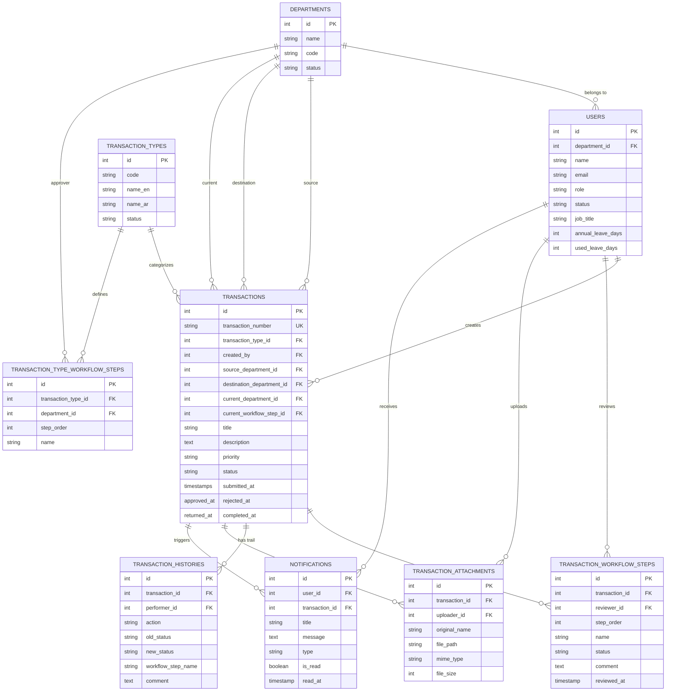
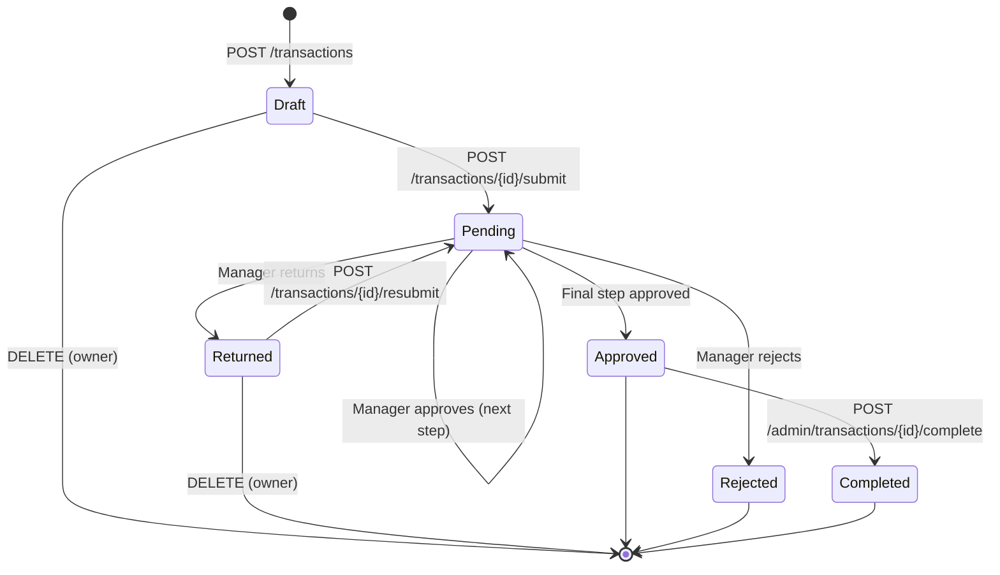
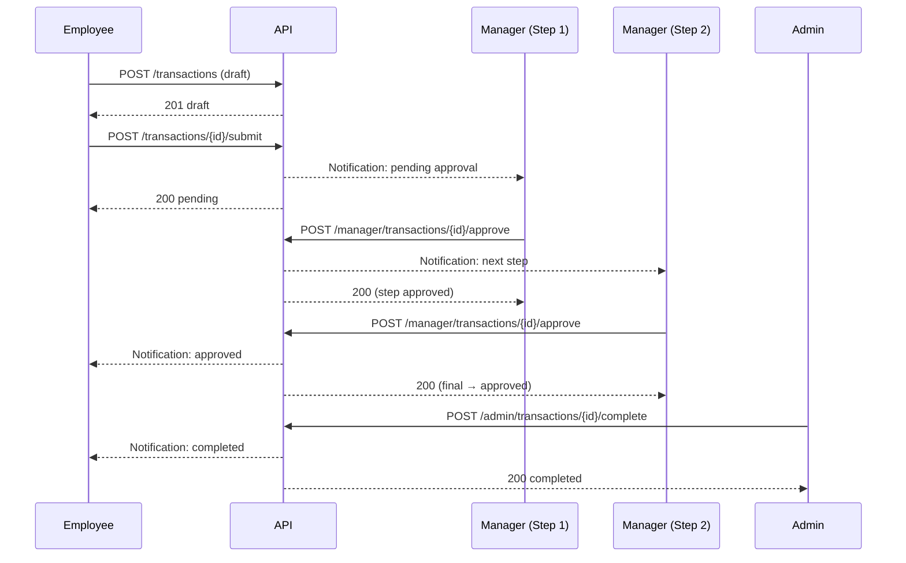

# Mu'amalati Platform — Diagrams

Render these Mermaid diagrams in any Mermaid-compatible viewer (VS Code + Mermaid extension, GitHub, mermaid.live).

---

## 1. Entity-Relationship (ER) Diagram



---

## 2. Transaction Workflow (State Machine)



---

## 3. Workflow Approval Flow (Sequence)



---

## 4. Return / Resubmit Flow (Sequence)

```mermaid
sequenceDiagram
    participant E as Employee
    participant API as API
    participant M as Manager

    E->>API: POST /transactions/{id}/submit
    API-->>M: Notification: pending
    M->>API: POST /manager/transactions/{id}/return (comment)
    API-->>E: Notification: returned
    API-->>M: 200 returned

    E->>API: PATCH /transactions/{id} (edit)
    E->>API: POST /transactions/{id}/resubmit
    API-->>M: Notification: pending (same step)
    API-->>E: 200 pending
